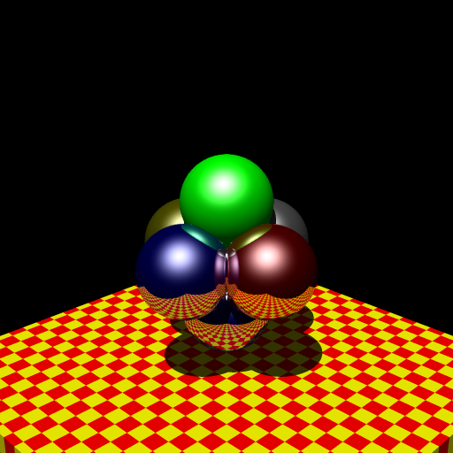

# Raytracing 1985

## 概要

1985年に作成された高速レイトレーシング・レンダラーの再現プロジェクトです。
当時のPC-9801で8087（浮動小数点コプロセッサ）なしに10倍高速化を実現した
独自の対数・指数テーブルを使った浮動小数点演算ルーチンを現代のCで再実装しています。
精度を犠牲にしたアセンブラ最適化により、8087相当の計算速度を達成した
レンダリング技術の記録・復元作業です。

## ディレクトリ構成

- `converted/` - 2025年にCに変換されたソースコード
  - レイトレーシングのメインルーチン（ray1.c, ray2.c, ray3.c, ray4.c）
  - 対数・指数テーブル、浮動小数点演算（logexptbl.c, reala.c）
  - バンプマッピング（bump1.c）
  - ヘッダーファイル（trace.h, reala.h）
- `original/` - 1985年時点のオリジナルファイル
- `sld/` - モデルファイル
- `animations/` - アニメーション生成スクリプトファイル
- `history.md` - プロジェクトの詳細な背景と技術史

## 40年前のプログラムの再現

元はPC-9801のMS-DOS用に開発されたプログラムでした。
1995年にも一度再現したことがあり、そのときはWindows 95の16bitモードで
動かしていました。

その後、Windowsでも16bitモードはサポートされなくなり、
長らく眠っていたソースコードですが、Cに変換すれば現在のコンピュータでも
実行できるだろうと思ったのが今回のプロジェクトです。

アセンブラプログラムは、MASMで書かれており、当時の8086には
仮想メモリやメモリアクセス例外などもなかったことから、
セグメントレジスタなどを駆使したワイルドなものでした。
asmからCへの変換はasm2c.rbというスクリプトで概略を変換し、
細かい部分は人力で変換しています。jnz命令などが多用されている
部分はCのgoto文にマッピングしています。

浮動小数点ライブラリreala.cはClaude Codeに作成してもらいました。
残念ながらexp, logなどの実装は元実装を完全に無視したデタラメになっていたので、
自力で移植し直しました。

1985年当時に何をしたかは [history.md](history.md) ファイルに書きました。

## 拡張案

昔の技術を再現する目的で変換したものの、動くようになると
手を加えたくなるものです。こんな感じのものが考えられそうです
(いくつかはすでに作っちゃいました)。

- [x] sldファイルのコメントシンタックス
- [x] アンチエイリアシング
- [ ] 複数光源対応
- [ ] 環境マッピング
- [ ] real型でなくdouble型で計算したほうが現在のCPUでは速そう

