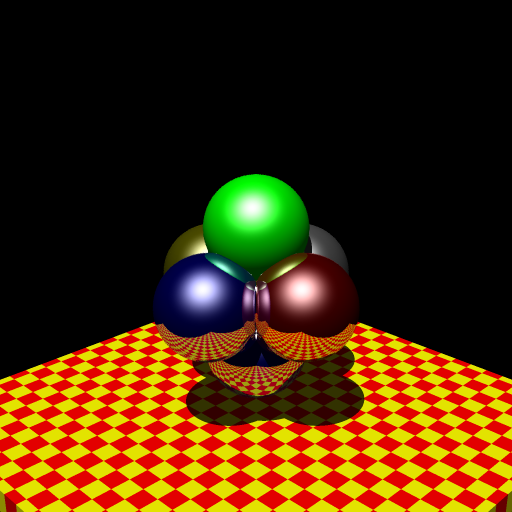

# Raytracing 1985

## Overview

This is a reproduction project of a ray tracing renderer created in 1985.
It reimplements in modern C the original floating-point arithmetic routines using logarithm and exponent tables,
that achieved 10x speedup on PC-9801 without 8087 (floating-point coprocessor).
This is a record and restoration work of rendering technology that achieved 8087-equivalent computation speed
through assembly optimization that sacrificed precision.

## Directory Structure

- `converted/` - Source code converted to C in 2025
  - Ray tracing main routines (ray1.c, ray2.c, ray3.c, ray4.c)
  - Logarithm/exponent tables, floating-point arithmetic (logexptbl.c, reala.c)
  - Bump mapping (bump1.c)
  - Header files (trace.h, reala.h)
- `original/` - Original files from 1985
- `sld/` - Model files
- `animations/` - Animation generation script files
- `history.md` - Detailed background and technical history of the project

## Reproducing a 40-Year-Old Program

Originally developed for PC-9801 MS-DOS.
It was reproduced once in 1995, running in Windows 95's 16-bit mode.
Later, Windows stopped supporting 16-bit mode,
and the source code lay dormant for a long time. The current project began
with the idea that converting it to C would allow it to run on modern computers.

The assembly programs were written in MASM.  Since the 8086 of that time
had no virtual memory or memory access exceptions,
they were wild programs that made full use of segment registers.
The conversion from asm to C used a script called `asm2c.rb` for rough conversion,
with detailed parts converted manually. Parts heavily using `jnz` instructions
are mapped to C `goto` statements.

The floating-point library `reala.c` was created with Claude Code.
Unfortunately, the implementations of `exp`, `log`, etc. were completely wrong nonsense
that ignored the original implementation, so I had to port them myself.

Episodes back in 1985 are written in the [history_en.md](history_en.md) file.

## Extension Ideas

While converted for the purpose of reproducing old technology, once it works,
I want to add some improvements. These kinds of things seem possible
(some have already been done).

- [x] Comment syntax for sld files
- [x] Anti-aliasing
- [ ] Multiple light source support
- [ ] Environment mapping
- [ ] Calculations with `double` instead of `real` would likely be faster on current CPUs
